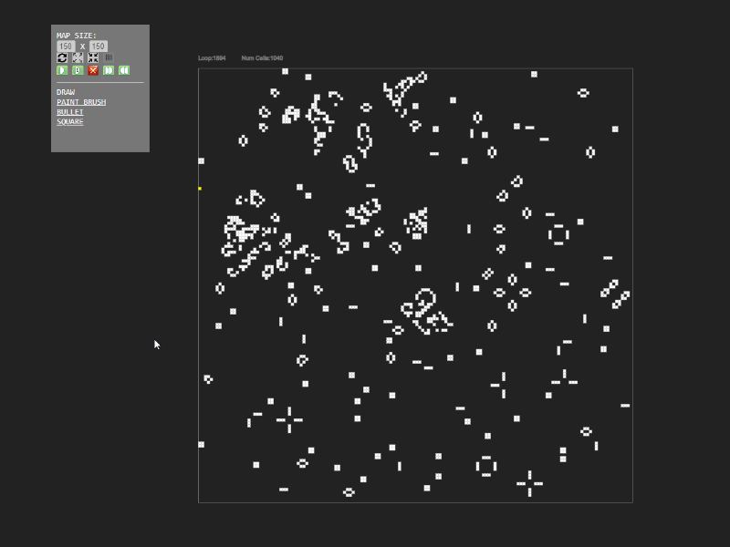
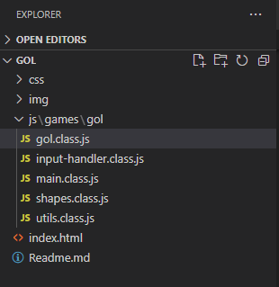
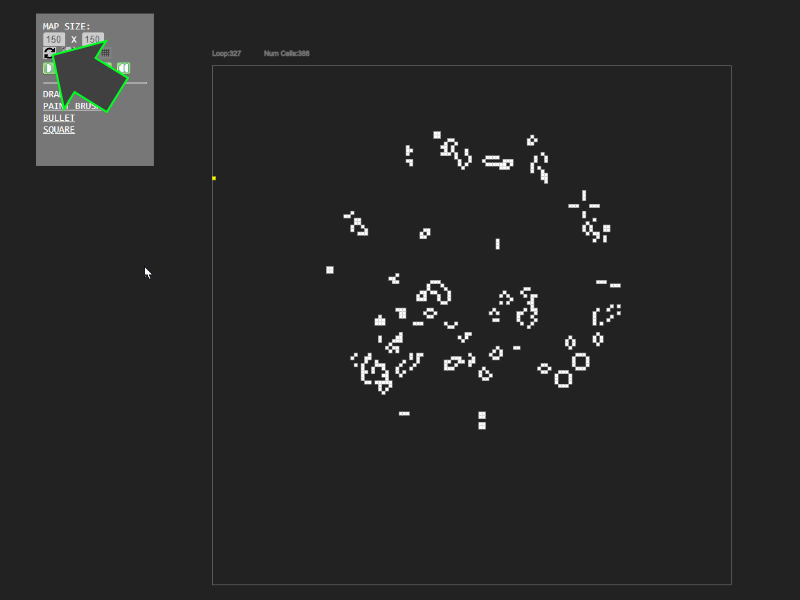
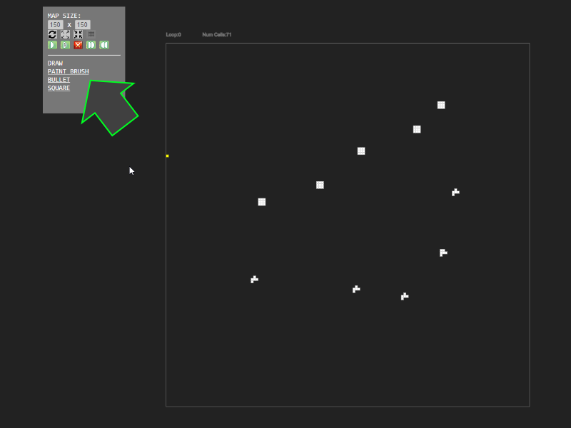

# Conrad's Game of Life

[Demo](https://www.beamerlabs.com/lab/gol/)

Playing around with [Conrad's Game of Life](https://conwaylife.com/wiki/Conway's_Game_of_Life).

It's a cellular automation playground. 

For more interesting shapes and what not see the [Life Wiki](https://conwaylife.com/)

The interface is pretty intuitive but...

The logic for the game was pretty simple, all logic can be found in /js/games/gol.class.js.

You can draw on the screen and let the automation take over from your drawing. You can even add and draw while it is running the automation.

You can use the "reset" icon to go back to the initial version before automation kicked in.

You can add shapes to the map instead of drawing things

[Demo](https://www.beamerlabs.com/lab/game-of-life/)

